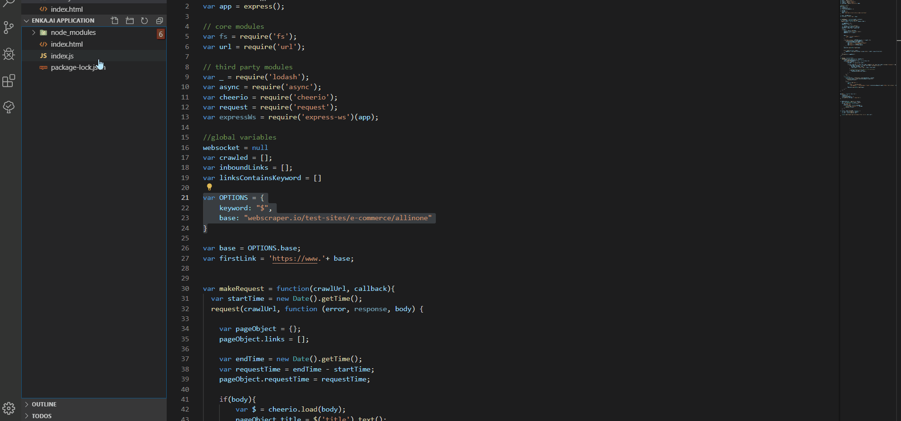

# webcrawler-app
A realtime express-vue web crawler app

### Prerequisites

Install node.js and npm from https://nodejs.org/en/download

### Installing & Running

Install packages and run localserver.

```
npm install
node index.js
```
After that, you would be able to see the app is running on localhost:8081

#### Note
You can crawl different websites with a keyword that you wish by changing the OPTIONS.base and OPTIONS.keyword in index.js.


